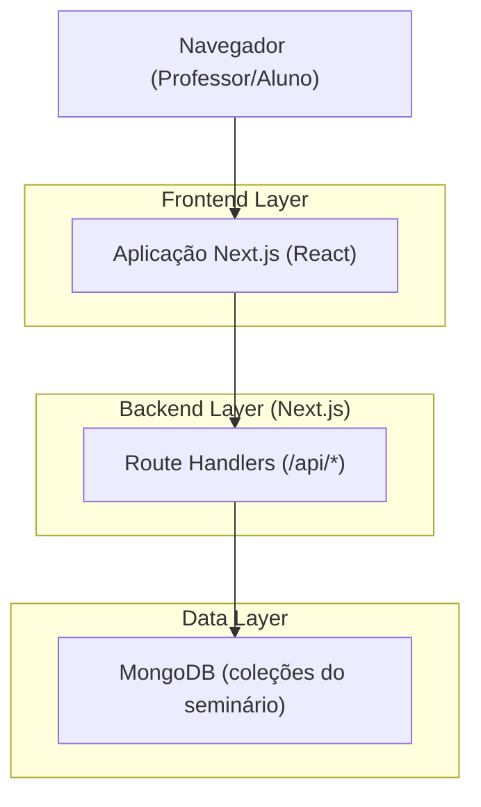
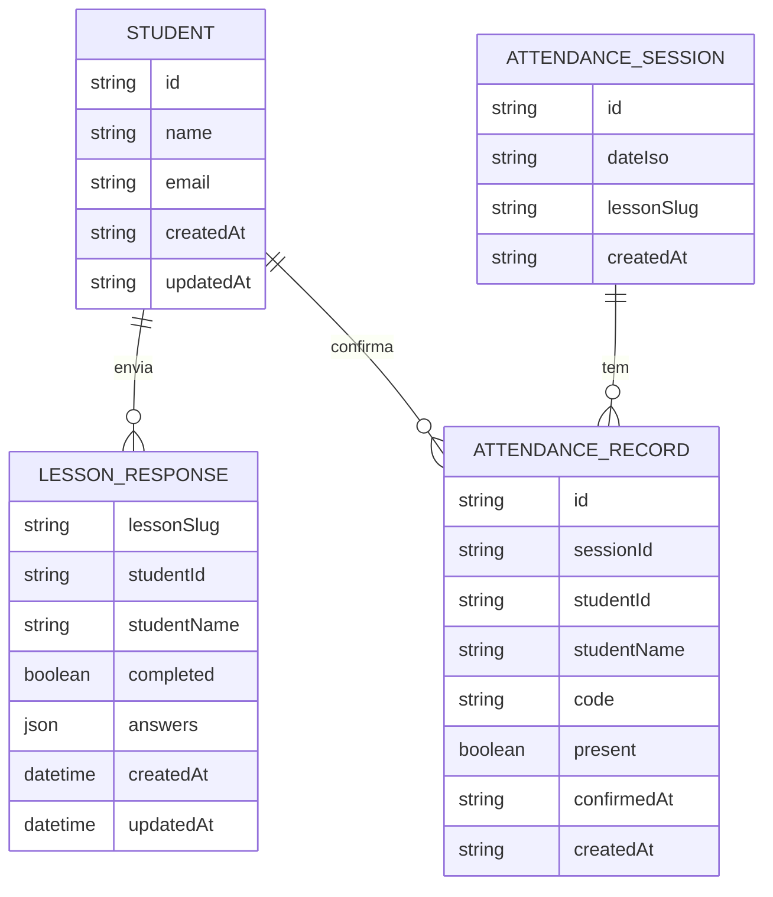

## 1.Architecture design

> Observação: o repositório também contém um backend Express + Prisma + Postgres em `server/` (para módulos/rotas específicas). A Página Demo proposta deve consumir prioritariamente as APIs já expostas em `/src/app/api/**` (MongoDB), para manter a demo simples.

## 2.Technology Description
- Frontend: Next.js@16 + React@19 + tailwindcss@3
- Backend: Next.js Route Handlers (Node runtime)
- Database: MongoDB@6 (coleções: students, lesson_responses, attendance_*)
- Backend (opcional/legado): Express + Prisma + PostgreSQL (pasta `server/`)

## 3.Route definitions
| Route | Purpose |
|-------|---------|
| /professor/login | Login do professor |
| /admin/demo | Página Demo do sistema (professor) |
| /admin/dashboard | Dashboard do professor (métricas) |
| /professor/respostas | Tabela de respostas dos alunos |
| /admin/attendance | Gestão/visão de chamada |
| /admin/students | Gestão/visão de alunos |
| /admin/lessons | Gestão/visão de aulas |
| /aulas/[slug] | Página de aula (aluno) |
| /student/attendance | Confirmação de presença por código |

## 4.API definitions (If it includes backend services)
Não aplicável (a Página Demo usa as rotas internas do Next.js em `/api/*`).

## 6.Data model(if applicable)
### 6.1 Data model definition

