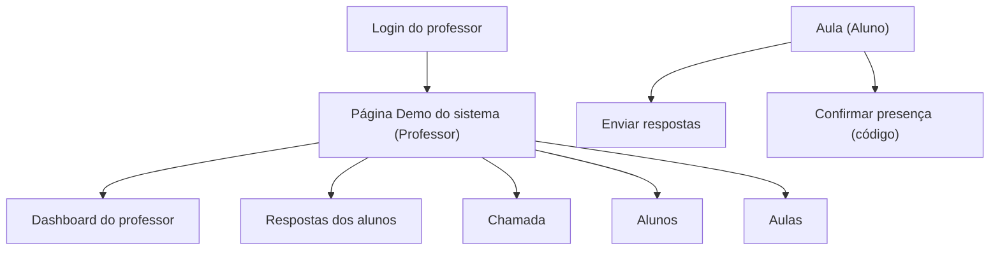

## 1. Product Overview
Página demo (interna) para o professor demonstrar, em um único lugar, todas as funcionalidades principais do sistema (aulas, respostas, chamada, alunos e métricas).
A página também oferece ações guiadas e validação visual de que o banco está “seedado” com dados realistas para alimentar o Dashboard do professor.

## 2. Core Features

### 2.1 User Roles
| Papel | Método de acesso | Permissões principais |
|------|-------------------|----------------------|
| Professor | Login com e-mail e senha | Ver dashboard, ver respostas, criar/consultar chamada, listar alunos, acessar página demo |
| Aluno | Acesso às aulas e envio de respostas; confirmação de presença por código | Responder lições, confirmar presença, acompanhar conteúdo |

### 2.2 Feature Module
1. **Login do professor**: autenticação; redirecionamento para página demo.
2. **Página Demo do sistema (Professor)**: visão geral das funcionalidades; atalhos; painéis de dados; ações de demonstração; validação do seed.

### 2.3 Page Details
| Page Name | Module Name | Feature description |
|-----------|-------------|---------------------|
| Login do professor | Formulário de login | Autenticar com e-mail e senha; exibir erros; redirecionar para a próxima rota (next) ou para a Página Demo. |
| Página Demo do sistema (Professor) | Cabeçalho + contexto da demo | Exibir objetivo da demo; mostrar ambiente (ex.: storage “mongo/local”); apresentar avisos quando MongoDB não estiver configurado. |
| Página Demo do sistema (Professor) | Atalhos (links) | Navegar rapidamente para: Dashboard do professor, Respostas, Chamada, Alunos, Aulas, Login do aluno, Confirmação de presença. |
| Página Demo do sistema (Professor) | Cartões de métricas (espelho do Dashboard) | Buscar e exibir Total de aulas, Total de alunos e Progresso médio; permitir “recarregar”. |
| Página Demo do sistema (Professor) | Painel “Respostas recentes” | Listar as últimas respostas (aluno, lição, atualizado em); abrir a tela completa de respostas. |
| Página Demo do sistema (Professor) | Painel “Chamada (últimas sessões)” | Listar últimas sessões com presentes/ausentes; abrir detalhes da sessão e lista de códigos. |
| Página Demo do sistema (Professor) | Painel “Alunos (amostra)” | Exibir amostra de alunos seedados; sinalizar alunos com alta/baixa participação (heurística simples baseada em respostas/presença). |
| Página Demo do sistema (Professor) | Ações guiadas de demo | Executar passos guiados: (1) criar sessão de chamada do dia, (2) ver códigos gerados, (3) simular confirmação (copiar código), (4) abrir lição para envio de resposta. |
| Página Demo do sistema (Professor) | Validação do seed | Rodar checagens mínimas e exibir checklist: 5 alunos cadastrados; N sessões de chamada; N respostas; progresso médio > 0%. |

## 3. Core Process
**Fluxo do professor (demo):**
1) Faz login.
2) Acessa a Página Demo.
3) Confere métricas e validação do seed.
4) Demonstra: navegação para Dashboard, listagem de respostas, criação/consulta de chamada e listagem de alunos.

**Fluxo do aluno (demo):**
1) Acessa uma aula.
2) Envia respostas (parciais ou completas).
3) Confirma presença digitando o código da chamada do dia.

## 4. Plano de Seed (5 alunos + presenças + respostas realistas)

### 4.1 Objetivo do seed
- Garantir que o **Dashboard do professor** exiba: Total de alunos = 5 e Progresso médio > 0%.
- Garantir que o professor tenha **dados visíveis** em: Respostas dos alunos e Chamada.
- Simular perfis realistas: aluno muito engajado, mediano, irregular e quase ausente.

### 4.2 Coleções/entidades a popular (MongoDB)
- `teacher_auth`: 1 professor (para login)
- `students`: 5 alunos
- `attendance_sessions`: 6 sessões de chamada
- `attendance_records`: 5 registros por sessão (um por aluno)
- `lesson_responses`: respostas em múltiplas lições (parciais e completas)

### 4.3 Professor (credenciais de demo)
- Nome: Arthur Souza Filho
- E-mail: arthur.souza@seminario.local
- Senha: Arthur@123456

### 4.4 Alunos (5) — nomes e e-mails realistas
| Apelido | Nome completo | E-mail | Perfil |
|---|---|---|---|
| A1 | Maria Eduarda Nunes | maria.nunes@seminario.local | Muito engajada (quase sempre responde e vai à chamada) |
| A2 | João Pedro Lima | joao.lima@seminario.local | Bom ritmo (responde a maioria) |
| A3 | Ana Clara Ribeiro | ana.ribeiro@seminario.local | Mediana (responde algumas; textos curtos) |
| A4 | Lucas Henrique Santos | lucas.santos@seminario.local | Irregular (respostas espaçadas; falta às vezes) |
| A5 | Beatriz Almeida | bia.almeida@seminario.local | Baixa participação (poucas respostas; faltas) |

> Padrão de `studentId` (compatível com o sistema): `student:<uuid>`.

### 4.5 Presenças (6 sessões) — datas, vínculo com lição e realismo
Criar 6 sessões de chamada com `dateIso` e `lessonSlug` (preferencialmente datas do calendário de lições).

| Sessão (dateIso) | lessonSlug sugerido | Presentes (de 5) |
|---|---|---|
| 2026-02-19 | aula-1-010-overview | 4 (A1,A2,A3,A4) |
| 2026-02-20 | aula-2-011-introduction | 5 (todos) |
| 2026-02-24 | aula-3-012-the-plan-of-salvation | 4 (A1,A2,A3,A5) |
| 2026-02-25 | aula-4-020-overview | 3 (A1,A2,A4) |
| 2026-02-26 | aula-5-021-abraham-3 | 4 (A1,A2,A3,A4) |
| 2026-02-27 | aula-6-022-moses-1 | 2 (A1,A2) |

Regras para `attendance_records`:
- Gerar 1 registro por aluno por sessão.
- `present: true` apenas para os listados.
- `confirmedAt`: horário realista (ex.: 19:05–19:20 no fuso local) para presentes; `null` para ausentes.
- `code`: 6 caracteres (letras/números, sem ambiguidade) — exemplo: `K7Q2MD`.

### 4.6 Respostas (lesson_responses) — distribuição para “progresso médio” visível
Seed recomendado: usar **20 lições** (as primeiras do `allLessonMetas`) e variar o volume por aluno.

| Aluno | Lição respondida (quantidade) | Completas (completed=true) | Observação |
|---|---:|---:|---|
| A1 (muito engajada) | 18 | 16 | Textos mais longos, reflexão consistente |
| A2 (bom ritmo) | 14 | 12 | Respostas completas, porém mais objetivas |
| A3 (mediana) | 10 | 7 | Algumas respostas parciais |
| A4 (irregular) | 7 | 4 | Responde “em blocos” (vários no mesmo dia) |
| A5 (baixa participação) | 3 | 1 | Quase sempre só “quebra-gelo” |

Campos esperados por documento em `lesson_responses`:
- `lessonSlug` (string)
- `studentId` (string)
- `studentName` (string)
- `completed` (boolean)
- `answers.icebreaker` (string curta)
- `answers.discussionNotes` (texto médio/longuinho)
- `answers.actionBefore` / `actionDuring` / `actionAfter` (curtas, tipo compromisso)
- `createdAt` e `updatedAt` (Date)

**Exemplos de textos (para variar e parecer humano):**
- Icebreaker: “Meu destaque foi perceber como Deus organiza as coisas com propósito.”
- Notes: “Eu anotei que o plano do Pai inclui escolhas reais. Fiquei pensando em como posso agir com mais intenção nesta semana…”
- Actions: “Antes: reler 5 min. Durante: fazer 1 anotação. Depois: compartilhar 1 ideia com alguém.”

### 4.7 Critérios de aceite do seed (checagem rápida na Página Demo)
- Total de alunos = 5.
- Pelo menos 6 sessões de chamada criadas.
- Pelo menos 40 documentos em `lesson_responses` com `completed=true`.
- Dashboard exibe Progresso médio > 0% (ideal: ~10–15% para parecer início de semestre).
